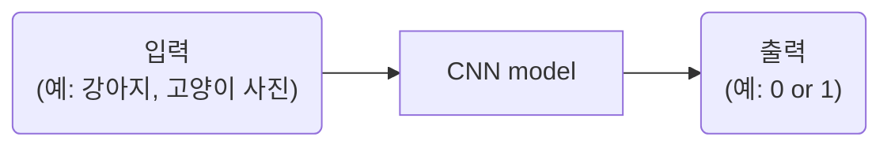
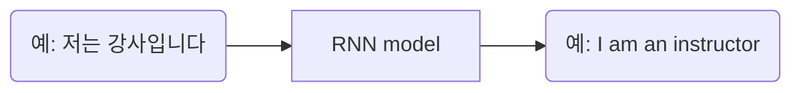

### Thm1. 
1-1강. 딥러닝 강의 소개  
인공지능 vs 머신러닝 vs 딥러닝  
AI⊃ML⊃DL  
AI: 인간의 지능(지적 능력)을 인공적으로 만든 것  
규칙 기반 알고리즘  
ML: 데이터를 기반으로 한 AI 
결정 트리, **선형 회귀**, **퍼셉트론**, SVM  
|규칙 기반|데이터 기반|
|--|--|
|인간이 규칙을 찾음|AI가 깨달음(훈련 과정)|  

1st. 훈련 과정: 데이터와 정답을 주입하여 학습  
2nd. 테스트 과정: 처음 보는 데이터 주입  

DL: 데이터 기반 + 딥 뉴런 네트워크(깊은 인공신경망)를 활용하여 학습  
**CNN**(Convolutional Neurall Network), RNN, GAN, 트랜스포머...  
인간의 사고 방식을 수학적으로 풀어내는 것이 딥러닝의 핵심  

1. CNN(Convolutional Neurall Network)

여기서, 입력과 출력 모두 숫자!  
```
이미지 = 숫자의 행렬  
컬러 이미지 = 3차원 행렬(R, G B)
size =  3(채널) x 5(행) x 5(렬)
```
|CNN|RNN|
|:--:|:--:|
|이미지 데이터|연속적 데이터|
||토크나이징|

2. RNN(Recurrent Neural Network)

여기서도 입력과 출력 모두 숫자!
단,  토크나이징 과정을 거침

토크나이징
1st. 토큰화  
예: 저는/강사/입니다, I/am/an/instructor  
2nd. 각각을 숫자로 바꾸기(벡터)
