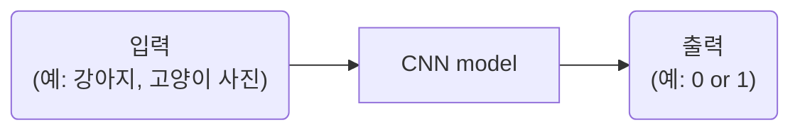
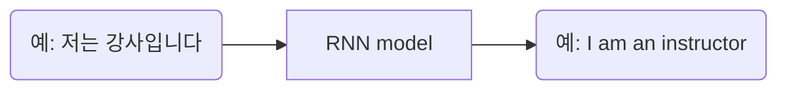
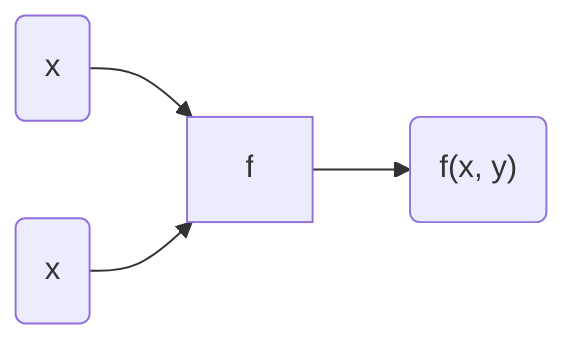

# Thm1. 왜 현재 AI가 가장 핫한가?
## 1-1강. 인공지능 vs 머신러닝 vs 딥러닝  
AI⊃ML⊃DL 

### 1. AI
인간의 지능(지적 능력)을 인공적으로 만든 것  
- 규칙 기반 알고리즘  


### 2. ML
데이터를 기반으로 한 AI 
- 결정 트리
- **선형 회귀**
-  **퍼셉트론**
-   SVM

|규칙 기반|데이터 기반|
|--|--|
|인간이 규칙을 찾음|AI가 깨달음(훈련 과정)|  

1st. **훈련 과정**: 데이터와 정답을 주입하여 학습  
2nd. **테스트 과정**: 처음 보는 데이터 주입  


### 3. DL
데이터 기반 + 딥 뉴런 네트워크(깊은 인공신경망)를 활용하여 학습  
인간의 사고 방식(지능)을 수학적으로 풀어내는 것이 딥러닝의 핵심  
- **CNN**(Convolutional Neurall Network)
- RNN
- GAN
- 트랜스포머...  

#### 1. CNN(Convolutional Neurall Network)


**[입력과 출력은 모두 숫자]**   
- 이미지 = 숫자의 행렬  
- 컬러 이미지 = 3차원 행렬(R, G, B)  
    size =  3(채널) x 5(행) x 5(렬)


#### 2. RNN(Recurrent Neural Network)

여기서도 입력과 출력 모두 숫자  
단,  **토크나이징** 과정을 거침

**[토크나이징]**  
**1st. 토큰화**  
예) 저는/강사/입니다, I/am/an/instructor  
**2nd. 각각을 숫자로 바꾸기**  
-> 벡터

|CNN|RNN|
|:--:|:--:|
|이미지 데이터|연속적 데이터|
||**토크나이징**|


Q&A  
Q. 구체적으로 인공신경망을 사용한다는 게 무슨 뜻인가?  

Q. RNN이 출력하는 값은 예를 들어 구체적으로 어떤 형태가 있는가?

---
## 1-2. 지도 학습과 비지도 학습

Machine Learning?  
지도 학습 vs 비지도 학습 vs 자기지도 학습 vs 강화 학습  

### 1. 지도 학습  
정답(사람이 미리 만들어 놓음)을 알고 있는 채로 학습  
TYPE1) **회귀**(regression): 연속된 값 출력  
TYPE2) **분류**(classification): 정해놓은 값 출력  
|회귀|분류|
|:--:|:--:|
|연속된 값|정해놓은 값|
  
> #### case1) Classiification
- 분류
 
> #### case2)Clssification + Localization
- 분류 + 회귀
- 회귀: x,y, width, height  
즉, 훈련 시 x, y, w, h 값까지 같이 넣고  
출력에서 x, y, w, h 값까지 같이 나오게 하는 것

> #### case3) Object Detection
- TYPE2에서 여러 객체가 튀어나옴

> #### case4) Instance Segmentaion
- 픽셀 마다 분류를 함
- 이미지(행렬) 출력

<br>

**+ Pose Estimation**
- 사람의 자세 추정
- 머리 (x, y), 몸(x, y), 어깨(x, y) 등등 입력, 출력


<br>

### 2. 비지도 학습
정답을 모름  
TYPE1) **군집화**(K-means, DBSCAN...)  
TYPE2) **차원 축소**(데이터 전처리: PCA, SVD...)

Q & A   
Q. Instance Segmentaion에서 그럼 각각의 픽셀은 한 영역에만 해당 가능한가?
A: 그렇다.

Q. 중간에 인스턴스 분할과 그냥 분할의 차이가 무엇인가?  
A: 같은 클래스의 객체들도 서로 구분하여 분할한다는 뜻  

Q. 그런데 AI는 도대체 어떤 원리로 데이터를 통해 학습이 가능한가?  

Q. 비지도 학습에 대해?  
A. 레이블이 없는 데이터에서 패턴이나 구조를 찾아내는 것  
&nbsp;&nbsp;&nbsp;&nbsp;정답이 주어지지 않은 상태에서 데이터를 스스로 학습
   - 군집화: 비슷한 특성을 가진 데이터들을 그룹으로 묶는 방법
   - 차원 축소: 데이터의 중요한 특성은 유지하면서 데이터의 복잡성을 줄이는 방법(-> 고차원 데이터 시각화, 처리 속도 증가)

---
## 1-3. 자기지도 학습   
지도학습?  
`문제` 정답 데이터들이 많아야 함-> 데이터 레이블링 비용 상당함  
`해결` 자기지도 학습!  
### "진짜 풀려고 했던 문제 말고 가짜 문제를 새롭게 정의해서 먼저 풀어본다"  

예) **1st.** 패치 위치를 랜덤하게 잡는다.  
&nbsp;&nbsp;&nbsp;&nbsp;&nbsp;&nbsp;**2nd.** 같은 사이즈의 패치들을 주변에 상대적인 위치로 찍는다.  
&nbsp;&nbsp;&nbsp;&nbsp;&nbsp;&nbsp;**3rd.** (일반적인 방법) 첫 패치 + 주변 하나 패치 입력-> 상대적인 위치를 출력하도록 학습시킨다.  
&nbsp;&nbsp;&nbsp;&nbsp;&nbsp;&nbsp;**4th.** 3rd를 무한 번 반복  

그렇다면 왜 이게 가능한가?  
픽셀들이 연속되어 있기 때문이다!  

<br>

> ### 자기지도 학습  
데이터 안에서 스스로 레이블(정답)을 만들어서 학습  
<br>
1st. **`pretext task`**(가짜 문제)를 학습해서 **pre-training**  
&nbsp;&nbsp;&nbsp;&nbsp;&nbsp;&nbsp;-> pre-trained model  
2nd. **downstream task**(분류)를 풀기 위해 **transfer learning**(전이 학습)  
&nbsp;&nbsp;&nbsp;&nbsp;&nbsp;&nbsp;-> classification model

|지도 학습|자기지도 학습|
|:--:|:--:|
|2nd|1st 후 2nd|

**[ pretext tast ]**  
TYPE1) **`Context prediction`**(위의 예시 참고)  
TYPE2) **`Contrastive learning`**  
&nbsp;&nbsp;&nbsp;&nbsp;&nbsp;&nbsp;&nbsp;&nbsp;&nbsp;&nbsp;&nbsp;1st. 사진1의 일부를 뗀 사진(1번 사진)을 CNN 모델에 넣은 후 나온 출력(1')  
&nbsp;&nbsp;&nbsp;&nbsp;&nbsp;&nbsp;&nbsp;&nbsp;&nbsp;&nbsp;&nbsp;2nd. 사진1에서 1st를 반복, 2번 사진과 2'  
&nbsp;&nbsp;&nbsp;&nbsp;&nbsp;&nbsp;&nbsp;&nbsp;&nbsp;&nbsp;&nbsp;3rd. 사진2에서 1st와 2nd를 반복, 3번 사진과 3', 4번 사진과 4'  
&nbsp;&nbsp;&nbsp;&nbsp;&nbsp;&nbsp;&nbsp;&nbsp;&nbsp;&nbsp;&nbsp;**4th. 출처 같은 사진은 비슷한 값이 나오게끔, 출처 다른 사진은 최대한 먼 값이 나오도록 학습시키는 기법**  

+**GPT**: 다음 단어를 예측하는 방식의 자기지도학습  
&nbsp;&nbsp;&nbsp;**BERT**: 문장 빈칸에 들어갈 단어 예측하는 방식의 자기지도학습  

Q & A  
Q. 레이블이란?  
A. 데이터에 대응하는 숫자들. 데이터에 대한 정답 또는 분류 결과.  

Q. 아무리 데이터가 연속적이기에 이미지를 인식하는 능력이 올라간다 하더라도 어떤 원리로 인공지능 모델이 자기지도 학습을 한 후에 이미지를 인식하는 능력이 올라갈 수 있는 것인지 이해가 가지 않는다.  

Q. Contrastive learning 예시에서 왜 출력이 5개의 숫자인가?

---

## 1-4. 강화  학습  
보상을 함으로써 어떤 행동을 하게끔 강화  
즉, **행동 → 보상**  

```yaml
Agent: 행동을 취하는 주체 (예: 강아지, 흑돌)
Action: Agent가 취할 수 있는  모든 행동 (예: 손, 뒤집기, 수)
Reward: Agent가 Action에 따라 받게 되는 보상 (예: 간식, 승점)
Envirionment: Reward를 언제, 얼마만큼 줄지 설계된 환경 (예: 주인, 심판, 백돌)
State: 현재 상태 (예: 위치)
Q-function: 특정 State에서 특정 Action을 했을 때 Reward의 기댓값(즉, Q(state, action)에 대한 함수)
Episode: 각각의 시행
Q-learning: 이전 state에서 행동했던 것에 대한 Q값을 업데이트 하는 것 → 가장 큰 값을 가지고 옴
exploration: 예) E-Greedy: 0에서 1까지의 확률로 다른 행동을 하게 함
discount factor(Γ): 0에서 1까지의 값. Q-learning에서 값을 가져올 때 Γ를 곱함.
```
> `Agent`가 `Action`을 통해 랜덤으로 행동해 `Reward`를 받음  
그러면서 `Q-function` 값을 기록하고 `Q-learning`을 하며 이를 반영해 움직임  
  
> 이때, 학습을 어느정도 하면 일정 행동만 할 수 있음  
→ `exploration`

> 그리고 Q값이 같을 때 최적의 행동이 무엇인지를 알려줘야 함  
→ `discount factor(Γ)`


  
Q&A  
Q. 1주년 예시에서 environment는 그럼 여자친구인가?  
Q. Q-fuction에서 지금까지 이동하며 얻은 보상은 포함되는가?  
A. 아니다.
Q. 1주년 강화학습에서 그럼 인공지능은 이전 데이터들을 참고하여 이동할 방향을 찾는 것인가? 아니면 그냥 랜덤인가?
Q. Q값이라는게 정확히 무엇을 의미는가? R값과 차이가 뭘까?  

---
# Thm2. 인공 신경망과 선형 회귀
## 2-1. 인공신경망 이해  
인공신경망: 신경을 인공적으로 표현한 것

1. 자극을 전달 받음  
2. 전달할지 말지 정함  
3. 전달함

&nbsp;&nbsp;&nbsp;이러한 신경의 기능을 구현  

### 1. 인공 신경  
**Node**(or unit)과 **connection**(or 엣지)로 구성  
  
**`바이어스`**: 민감도  
**`웨이트`**: 중요도  
즉, 주어진 입력에 대해 원하는 출력이 나오도록 위 두 가지를 조정 (이를 AI가 학습)  
  
**`엑티베이션`**: 활성화 함수. 신경의 활성화 여부 결정  
▼ **unit step function**(엑티베이션)  
  


# 
### 2. 인공신경망(ANN: Artificial Neural Network)  
인공신경이 여러개 있는 것 ( Input Layer, Output Layer, Hidden Layer로 구성 )    

```
1st: 웨이트  
2nd: 바이어스  
3rd: 엑티베이션  
4th: 위를 반복
```
  
이 때, 각 노드가 가진 웨이트 세트는 다르다! 그것이 그 노드의 역할이기 때문


  
  
```yaml
DNN(Deep Neural Network): 깊은 인공신경망  
FC layer(fully-connected): 노드끼리 다 연결한 층  
multilayer perceptron(MLP): 모든 layer가 FC layer인 신경망, hidden layer이 하나는 있어야 함  
```

  
  
Q. 같은 층에서 웨이트 값이 다른데, 그럼 일반적으로 바이어스 값은 같은가?

---
## 2-2. 인공신경망은 함수다 
### `" 인공신경망은 함수다! "`

&nbsp;&nbsp;&nbsp;&nbsp;&nbsp;&nbsp;**1st.** **입력값**에 대한 **출력값**을 알려줌  
&nbsp;&nbsp;&nbsp;&nbsp;&nbsp;&nbsp;**2nd.** AI가 입력과 출력을 연결하는 **함수**를 알아냄  ▼    
  
```
그러면 어떻게 이를 알아내는가?  
**sol)** 입력값에 대한 출력값 좌표를 서로 연결하여 함수를 찾고 고치는 과정을 반복함!  
```
  
> **AI = 함수**  
**학습 = 함수 찾기**
  
###  
###  
그럼 ax + b를 인공신경망으로 표현해보면?  
이것이 **linear activation** !
  
  
Q & A  
Q. 함수는 결과값이 하나 아닌가?  
A. 그건 수학적 정의일 뿐이다.

---
## 2-3. 선형 회귀(Linear Regression)  
> **선형 회귀**

입력과 출력 간의 관계(함수)를 **선형으로 놓고** 알아내는 것  
ax + b에서 **최적의 a와 b**를 알아내는 것  
&nbsp;&nbsp;&nbsp;&nbsp;&nbsp;&nbsp;&nbsp;&nbsp;&nbsp;&nbsp;&nbsp;&nbsp;&nbsp;&nbsp;&nbsp;&nbsp;&nbsp;&nbsp;&nbsp;&nbsp;&nbsp;&nbsp;&nbsp;↳ **`loss`** 를 최소화하는 a, b  


### > **`Loss(L)`**  
> **1st.** 자신이 풀고 싶은 문제에 맞게 정의

예)  AI의 예측(ŷ)과 실제 수익(y)의 차이
  

하지만 only 합으로만 할 경우 옳지 않은 함수도 가능하게 됨  
따라서 아래의 방법들 사용  
```
TYPE1) MAE  
TYPE2) MSE
```
|MAE(Mean Absolute Error)|MSE(Mean Squared Error|
|:--:|:--:|
|오차 절댓값의 평균(or 합)|오차 제곱의 평균(or 합)|
|Outlier(이상치)가 있을 경우 유리||  

####    
> **2nd.** (a, b)의 값을 바꿔가며 L식에 대입하여 L이 최소가 되는 (a, b)를 찾음

(L은 a와 b에 대한 방정식)  
  
  
하지만 이는 파라미터가 많아지면 불가능  
sol) **경사 하강법**

Q & A  
Q. 선형 회귀의 경우 파라미터가 두 개라서 일일히 a와 b를 대입해볼 수 있는 거라 하였다. 그렇다면 파라미터란?
A. 인공신경망에서 웨이트와 바이어스를 말한다.
  
---
## 2-4. 경사하강법(Gradient Descent)  
1st. 처음 a, b를 아무렇게나 정한다.  
2nd. 현재 (a, b)에서 L을 줄이는 **방향**으로 나아간다.(기울기를 확인)  

##  
  
### > 편미분

x도 변수, y도 변수라 한꺼번에 살펴보기 쉽지 않음-> x에 대한 변화율, y에 대한 변화율을 각각 봄  
- **x에 대한 편미분**: y를 상수취급 후 미분

$$
\frac{\partial f(x, y)}{\partial x} = \lim_{\Delta x \to 0} \frac{f(x + \Delta x, y) - f(x, y)}{\Delta x}
$$
- **y에 대한 편미분**: x를 상수취급 후 미분

$$
\frac{\partial f(x, y)}{\partial y} = \lim_{\Delta y \to 0} \frac{f(x, y + \Delta y) - f(x, y)}{\Delta y}
$$
### > 그라디언트
- x에 대한 편미분과 y에 대한 편미분을 벡터로 연결

$$
\nabla f(x, y) = \begin{bmatrix} \frac{\partial f}{\partial x} \\ \frac{\partial f}{\partial y} \end{bmatrix}
$$
### " 따라서 Gradient는 항상 가장 가파른 방향을 가리킨다! "  
**`" 변화율 "이라고 생각하면 이해가 쉬움`**  ↲

##  


> ### Gradient descent  
**1st.** 처음 [a, b] 적절히 랜덤하게 0근처로 잡는다. (**Initial weight**)  
**2nd.** 그 지점에서의 Gradient를 구한다.  
**3rd.** [a, b]에서 그 지점의 **`Gradient`** 와 **`Learning Rate`** 를 곱한 값을 뺀다.  
**4th.** 3rd에서 나온 벡터에 대해 위 과정을 반복한다.  
  
    


#### `Learning Rate`
> - 학습률
> - 0에서 1까지의 값을 가짐
> - 보폭 조절
> - 상수로 놓기도 해서 **스케줄링**해서 바꾸기도 함

**[문제점]**
1. 모든 데이터를 다 고려해 데이터의 양이 많아질 경우 계산 시간이 오래 걸림
2. Local minimun이 발생할 수 있다.  

  

Q & A  
Q. 그런데 만약 Learning Rate를 잘못 설정하면 파라미터의 x, y 절댓값들이 갑자기 커질 수도 있는가?
A. 학습률이 커질 경우 그럴 수 있다. 따라서 학습률을 조정하는 것이 중요
   
Q. 선형 회귀에서 a와 b가 결과를 나타내는 데 사용된다면 거기서 엑티베이션은 무엇일까?  
A. 엑티베이션은 보통 신경망에서 사용되는 용어, 선형 회귀에서는 일반적으로 등장하지 않음.
  
---
## 2-5. 웨이트 초기화 기법들  
## # > Initial weight
TYPE1) **LeCun**  
TYPE2) **Kaiming**  
TYPE1) **LeCun**  

|공통점|랜덤하게 0 근처로 잡자|
|--|--|
|**차이점**|**분산이 다름**|

  
  
> TYPE1) **LeCun**  
- w : wait  
- U : Uniform, 균등 분포  
- N : Normal, 정규 분포 (평균과 분산의 함수)  
- N_in : 입력 개수  
- N_out : 출력 개수
  
> TYPE2) **Kaiming**  

LeCun함수에서 분산 2배
  
> TYPE3) **Xavier** 

분산이 더 작아짐
  
**Q.** N_in과 N_out를 사용하는 경우?  
**A.** N_in이 매우 많을 경우, 분산이 더 커질 것임.  
&nbsp;&nbsp;&nbsp;&nbsp;이러면 activation으로 출력할 때 불안정해짐
  
Q & A  
Q. ReLU가 무엇인가?
A. 신경망에서 자주 사용되는 활성화 함수로, 입력이 양수면 그대로 출력, 음수면 0으로 출력  

Q. sigmoid/tanh이 무엇인가?  
A. sigmoid: 출력값이 0과 1 사이, 확률 값처럼 사용 가능  
Tahn: 출력값이 -1과 1 사이  
  
Q. 분산의 정의가 구체적으로 무엇인가?  
A.  데이터의 평균오부터 편차(차이)의 제곱을 평균낸 값  

---
# Thm3  
## 3-1. Gradient Descent의 두 가지 단점  
1. 너무 신중하다.  
   모든 데이터를 다 고려하여 이를 편미분하고 계산하기 때문  
2. Local minimun이 발생할 수 있다.  
   가장 처음 만난 Local minimun이 가장 좋을 거라고 장담할 수 없음

---
## 3-2. 확률적 경사 하강법(SGD: Stochastic Gradient Descent)  
GD의 두 가지 문제점을 완화

### " 랜덤하게 데이터를 하나씩 뽑아서 loss를 만든다 "  
```yaml 
1st: 데이터 중 하나를 뽑아 loss를 만든다.    
2nd: 그 값을 L로 이용하여 Gradient를 업데이트한 후 한 번 계산한다.  
3rd: 나머지 데이터 중 하나를 뽑아 loss를 만들고 2nd를 실행한다.  
4th: 데이터가 없을 경우 다시 채워 위를 반복한다.  
5th: R값이 충분히 수렴할 때까지 이를 반복한다.  
```
**Q.** 왜 gradient가 GD에서의 minimum을 향하지 않을까?  
**A.** 데이터 중 하나를 뽑아 만든 L 그래프이기 때문이다. 

> 1. 하나만 보고 빠르게 방향을 결정  -> 첫 번째 문제 해결
> 2. 확률적으로 더 나은 minimin을 찾을 수 있음 -> 두 번째 문제 해결

