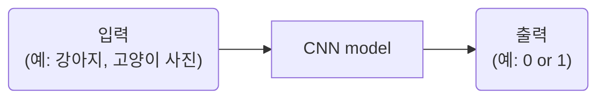
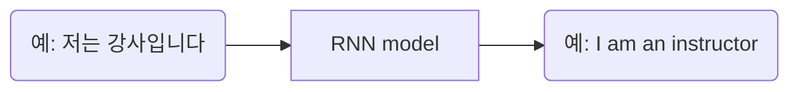

# Thm1. 왜 현재 AI가 가장 핫한가?
## 1-1강. 인공지능 vs 머신러닝 vs 딥러닝  
AI⊃ML⊃DL 

### 1. AI
인간의 지능(지적 능력)을 인공적으로 만든 것  
- 규칙 기반 알고리즘  

### 2. ML
데이터를 기반으로 한 AI 
- 결정 트리
- **선형 회귀**
-  **퍼셉트론**
-   SVM

|규칙 기반|데이터 기반|
|--|--|
|인간이 규칙을 찾음|AI가 깨달음(훈련 과정)|  

1st. `훈련 과정`: 데이터와 정답을 주입하여 학습  
2nd. `테스트 과정`: 처음 보는 데이터 주입  

### 3. DL
데이터 기반 + 딥 뉴런 네트워크(깊은 인공신경망)를 활용하여 학습  
인간의 사고 방식(지능)을 수학적으로 풀어내는 것이 딥러닝의 핵심  
- **CNN**(Convolutional Neurall Network)
- RNN
- GAN
- 트랜스포머...  

#### 1. CNN(Convolutional Neurall Network)

**[입력과 출력은 모두 숫자]**   
- 이미지 = 숫자의 행렬  
- 컬러 이미지 = 3차원 행렬(R, G, B)  
    size =  3(채널) x 5(행) x 5(렬)

#### 2. RNN(Recurrent Neural Network)

여기서도 입력과 출력 모두 숫자  
단,  **토크나이징** 과정을 거침

**[토크나이징]**  
**1st. 토큰화**  
예) 저는/강사/입니다, I/am/an/instructor  
**2nd. 각각을 숫자로 바꾸기**  
-> 벡터

|CNN|RNN|
|:--:|:--:|
|이미지 데이터|연속적 데이터|
||**토크나이징**|

헷갈렸던 내용  
구체적으로 인공신경망을 사용한다는 게 무슨 뜻인가?  

---
## 1-2. 지도 학습과 비지도 학습

Machine Learning?  
지도 학습 vs 비지도 학습 vs 자기지도 학습 vs 강화 학습

### 1. 지도 학습
정답(사람이 미리 만들어 놓음)을 알고 있는 채로 학습하는 것
- 회귀(regression): 연속된 값 출력
- 분류(classification): 정해놓은 값 출력

TYPE1) Classiification
- 분류
TYPE2)Clssification + Localization
- 분류
- 회귀: x,y, width, height
TYPE3)
graph LR
A(예: 저는 강사입니다)-->B[RNN model]
B-->C(예: I am an instructor)
B-->D[Output 1]
B-->E[Output 2]

