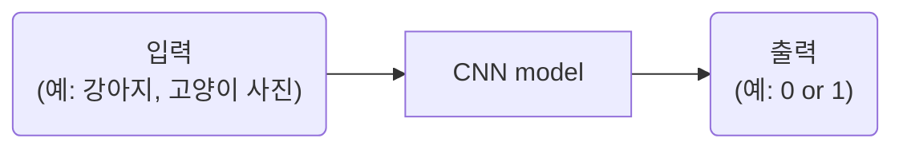
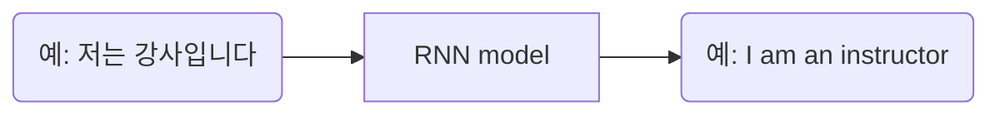

# Thm1. 왜 현재 AI가 가장 핫한가?
## 1-1강. 인공지능 vs 머신러닝 vs 딥러닝  
AI⊃ML⊃DL 

### 1. AI
인간의 지능(지적 능력)을 인공적으로 만든 것  
- 규칙 기반 알고리즘  

### 2. ML
데이터를 기반으로 한 AI 
- 결정 트리
- **선형 회귀**
-  **퍼셉트론**
-   SVM

|규칙 기반|데이터 기반|
|--|--|
|인간이 규칙을 찾음|AI가 깨달음(훈련 과정)|  

1st. **훈련 과정**: 데이터와 정답을 주입하여 학습  
2nd. **테스트 과정**: 처음 보는 데이터 주입  

### 3. DL
데이터 기반 + 딥 뉴런 네트워크(깊은 인공신경망)를 활용하여 학습  
인간의 사고 방식(지능)을 수학적으로 풀어내는 것이 딥러닝의 핵심  
- **CNN**(Convolutional Neurall Network)
- RNN
- GAN
- 트랜스포머...  

#### 1. CNN(Convolutional Neurall Network)

**[입력과 출력은 모두 숫자]**   
- 이미지 = 숫자의 행렬  
- 컬러 이미지 = 3차원 행렬(R, G, B)  
    size =  3(채널) x 5(행) x 5(렬)

#### 2. RNN(Recurrent Neural Network)

여기서도 입력과 출력 모두 숫자  
단,  **토크나이징** 과정을 거침

**[토크나이징]**  
**1st. 토큰화**  
예) 저는/강사/입니다, I/am/an/instructor  
**2nd. 각각을 숫자로 바꾸기**  
-> 벡터

|CNN|RNN|
|:--:|:--:|
|이미지 데이터|연속적 데이터|
||**토크나이징**|

헷갈렸던 내용  
구체적으로 인공신경망을 사용한다는 게 무슨 뜻인가?  

---
## 1-2. 지도 학습과 비지도 학습

Machine Learning?  
지도 학습 vs 비지도 학습 vs 자기지도 학습 vs 강화 학습  

### 1. 지도 학습  
정답(사람이 미리 만들어 놓음)을 알고 있는 채로 학습  
TYPE1) **회귀**(regression): 연속된 값 출력  
TYPE2) **분류**(classification): 정해놓은 값 출력  

#### case1) Classiification
- 분류
 
#### case2)Clssification + Localization
- 분류 + 회귀
- 회귀: x,y, width, height  
즉, 사진을 넣을 때 x, y, w, h 값까지 같이 넣고  
출력에서도 x, y, w, h 값까지 같이 나오게 하는 것

#### case3) Object Detection
- TYPE2에서 여러 객체가 튀어나옴

#### case4) Instance Segmentaion
- 픽셀 마다 분류를 함
- 이미지(행렬) 출력

 

**+ Pose Estimation**
- 사람의 자세 추정
- 머리 (x, y), 몸(x, y), 어깨(x, y) 등등 입력, 출력

### 2. 비지도 학습
정답을 모름  
TYPE1) **군집화**(K-means, DBSCAN...)  
TYPE2) **차원 축소**(데이터 전처리: PCA, SVD...)

Q & A  
1. Instance Segmentaion에서 그럼 각각의 픽셀은 한 영역에만 해당 가능한가?
   A: 그렇다.
3. 중간에 인스턴스 분할과 그냥 분할의 차이가 무엇인가?  
   A: 같은 클래스의 객체들도 서로 구분하여 분할한다는 뜻
4. 그런데 AI는 도대체 어떤 원리로 데이터를 통해 학습이 가능한가?
5. 비지도 학습에 대해?
   레이블이 없는 데이터에서 패턴이나 구조를 찾아내는 것  
   정답이 주어지지 않은 상태에서 데이터를 스스로 학습
   - 군집화: 비슷한 특성을 가진 데이터들을 그룹으로 묶는 방법
   - 차원 축소: 데이터의 중요한 특성은 유지하면서 데이터의 복잡성을 줄이는 방법(-> 고차원 데이터 시각화, 처리 속도 증가)
