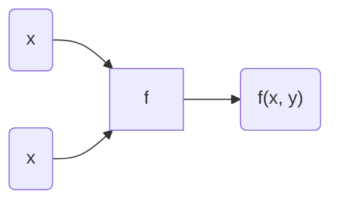

## 2-4. 경사하강법(Gradient Descent)  
1st. 처음 a, b를 아무렇게나 정한다.  
2nd. 현재 (a, b)에서 L을 줄이는 **방향**으로 나아간다.(기울기를 확인)  

##  
  
### > 편미분

x도 변수, y도 변수라 한꺼번에 살펴보기 쉽지 않음-> x에 대한 변화율, y에 대한 변화율을 각각 봄  
- **x에 대한 편미분**: y를 상수취급 후 미분

$$
\frac{\partial f(x, y)}{\partial x} = \lim_{\Delta x \to 0} \frac{f(x + \Delta x, y) - f(x, y)}{\Delta x}
$$
- **y에 대한 편미분**: x를 상수취급 후 미분

$$
\frac{\partial f(x, y)}{\partial y} = \lim_{\Delta y \to 0} \frac{f(x, y + \Delta y) - f(x, y)}{\Delta y}
$$
### > 그라디언트
- x에 대한 편미분과 y에 대한 편미분을 벡터로 연결

$$
\nabla f(x, y) = \begin{bmatrix} \frac{\partial f}{\partial x} \\ \frac{\partial f}{\partial y} \end{bmatrix}
$$
### " 따라서 Gradient는 항상 가장 가파른 방향을 가리킨다! "  
**`" 변화율 "이라고 생각하면 이해가 쉬움`**  ↲

##  

> ### Gradient descent  
**1st.** 처음 [a, b] 적절히 랜덤하게 0근처로 잡는다. (**Initial weight**)  
**2nd.** 그 지점에서의 Gradient를 구한다.  
**3rd.** [a, b]에서 그 지점의 **`Gradient`** 와 **`Learning Rate`** 를 곱한 값을 뺀다.  
**4th.** 3rd에서 나온 벡터에 대해 위 과정을 반복한다.  
  
    

#### `Learning Rate`
> - 학습률
> - 0에서 1까지의 값을 가짐
> - 보폭 조절
> - 상수로 놓기도 해서 **스케줄링**해서 바꾸기도 함

**[문제점]**
1. 모든 데이터를 다 고려해 데이터의 양이 많아질 경우 계산 시간이 오래 걸림
2. Local minimun이 발생할 수 있다.  

  

Q & A  
Q. 그런데 만약 Learning Rate를 잘못 설정하면 파라미터의 x, y 절댓값들이 갑자기 커질 수도 있는가?
  
---
