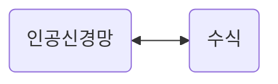

## 5-1. Linear activation  
결국 MLP는..  
**행렬** 곱하고 **벡터** 더하고 **activation**의 반복  
그리고 인공 신경망은 **함수**  

  
예시: 

$$
\begin{bmatrix} x_{1} \\ x_{2} \end{bmatrix}
\begin{bmatrix} 
w_{1} & w_{3} & w_{5} \\ 
w_{2} & w_{4} & w_{6} 
\end{bmatrix}=
\begin{bmatrix} b_{1} \\ b_{2} \\ b_{3} \end{bmatrix}
$$

각각을 x, W₁, b₁이라고 하면  
&nbsp;&nbsp;&nbsp;&nbsp;&nbsp;&nbsp;&nbsp;&nbsp;&nbsp;&nbsp;&nbsp;**f₁( xW₁ + b₁ )**  
두 번째 layer을 거친다면  
&nbsp;&nbsp;&nbsp;&nbsp;&nbsp;&nbsp;&nbsp;&nbsp;&nbsp;&nbsp;&nbsp;**f₂( f₁( xW₁ + b₁ )W₂ + b₂ )**  

그런데 만약 activaion들이 모두 linear activation이라면 깊어져도 복잡한 함수를 구현할 수 없다  
왜?  
위의 식에서 두 함수가 모두 linear activation이라면 들어온 대로 나가므로  
&nbsp;&nbsp;&nbsp;&nbsp;&nbsp;&nbsp;&nbsp;&nbsp;&nbsp;&nbsp;&nbsp;**( xW₁ + b₁ )W₂ + b₂**  
전개하면  
&nbsp;&nbsp;&nbsp;&nbsp;&nbsp;&nbsp;&nbsp;&nbsp;&nbsp;&nbsp;&nbsp;**xW₁W₂ + b₁W₂ + b₂**  
  
그러면 
W₁W₂를 하나의 matrix **W**로 생각할 수 있고  
b₁W₂ + b₂를  1 x 2의 **b**라는 행벡터로 생각할 수 있음  

따라서 2층 layer의 인공신경망이 1층 layer의 인공신경망이 됨  
즉, 모두 linear activaion이라면 하나의 layer밖에 표현하지 못함  
### ∴ non-linear activaion 필요  

+그럼 만약에..
linear->non-linear->linear->non-linear 형태라면..?  
&nbsp;&nbsp;&nbsp;&nbsp;&nbsp;&nbsp;&nbsp;&nbsp;&nbsp;&nbsp;&nbsp;1. **xW₁ + b₁**  
&nbsp;&nbsp;&nbsp;&nbsp;&nbsp;&nbsp;&nbsp;&nbsp;&nbsp;&nbsp;&nbsp;2. **( xW₁ + b₁ )W₂ + b₂**  
&nbsp;&nbsp;&nbsp;&nbsp;&nbsp;&nbsp;&nbsp;&nbsp;&nbsp;&nbsp;&nbsp;3. **f₁(( xW₁ + b₁ )W₂ + b₂)**  
&nbsp;&nbsp;&nbsp;&nbsp;&nbsp;&nbsp;&nbsp;&nbsp;&nbsp;&nbsp;&nbsp;4. **f₁(( xW₁ + b₁ )W₂ + b₂)W₃ + b₃**  
&nbsp;&nbsp;&nbsp;&nbsp;&nbsp;&nbsp;&nbsp;&nbsp;&nbsp;&nbsp;&nbsp;5. **(f₁(( xW₁ + b₁ )W₂ + b₂)W₃ + b₃)W₄ + b₄**  
&nbsp;&nbsp;&nbsp;&nbsp;&nbsp;&nbsp;&nbsp;&nbsp;&nbsp;&nbsp;&nbsp;6. **f₂((f₁(( xW₁ + b₁ )W₂ + b₂)W₃ + b₃)W₄ + b₄)**  
이 경우 2층 layer의 인공신경망이 됨  

그럼 linear activation을 어떻게 쓰는가?  
1. **회귀 분류 문제**   
   선형 회귀를 쓸 때 마지막 activation
2. **정보 손실을 막기 위해**
   이 경우에는 인공신경망 중간에 linear activation을 사용하기도 한다.  

---
