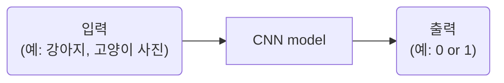
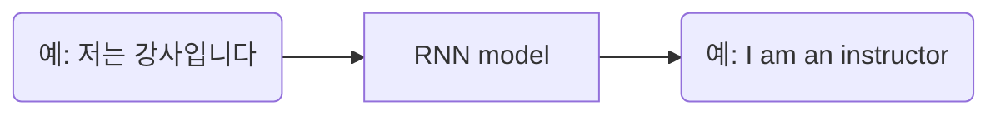
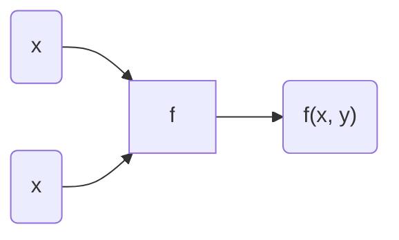
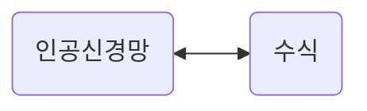

# Thm1. 왜 현재 AI가 가장 핫한가?
## 1-1강. 인공지능 vs 머신러닝 vs 딥러닝  
AI⊃ML⊃DL 

### 1. AI
인간의 지능(지적 능력)을 인공적으로 만든 것  
- 규칙 기반 알고리즘  


### 2. ML
데이터를 기반으로 한 AI 
- 결정 트리
- **선형 회귀**
-  **퍼셉트론**
-   SVM

|규칙 기반|데이터 기반|
|--|--|
|인간이 규칙을 찾음|AI가 깨달음(훈련 과정)|  

1st. **훈련 과정**: 데이터와 정답을 주입하여 학습  
2nd. **테스트 과정**: 처음 보는 데이터 주입  


### 3. DL
데이터 기반 + 딥 뉴런 네트워크(깊은 인공신경망)를 활용하여 학습  
인간의 사고 방식(지능)을 수학적으로 풀어내는 것이 딥러닝의 핵심  
- **CNN**(Convolutional Neurall Network)
- RNN
- GAN
- 트랜스포머...  

#### 1. CNN(Convolutional Neurall Network)


**[입력과 출력은 모두 숫자]**   
- 이미지 = 숫자의 행렬  
- 컬러 이미지 = 3차원 행렬(R, G, B)  
    size =  3(채널) x 5(행) x 5(렬)


#### 2. RNN(Recurrent Neural Network)

여기서도 입력과 출력 모두 숫자  
단,  **토크나이징** 과정을 거침

**[토크나이징]**  
**1st. 토큰화**  
예) 저는/강사/입니다, I/am/an/instructor  
**2nd. 각각을 숫자로 바꾸기**  
-> 벡터

|CNN|RNN|
|:--:|:--:|
|이미지 데이터|연속적 데이터|
||**토크나이징**|


Q&A  
Q. 구체적으로 인공신경망을 사용한다는 게 무슨 뜻인가?  

Q. RNN이 출력하는 값은 예를 들어 구체적으로 어떤 형태가 있는가?

---
## 1-2. 지도 학습과 비지도 학습

Machine Learning?  
지도 학습 vs 비지도 학습 vs 자기지도 학습 vs 강화 학습  

### 1. 지도 학습  
정답(사람이 미리 만들어 놓음)을 알고 있는 채로 학습  
TYPE1) **회귀**(regression): 연속된 값 출력  
TYPE2) **분류**(classification): 정해놓은 값 출력  
|회귀|분류|
|:--:|:--:|
|연속된 값|정해놓은 값|
  
> #### case1) Classiification
- 분류
 
> #### case2)Clssification + Localization
- 분류 + 회귀
- 회귀: x,y, width, height  
즉, 훈련 시 x, y, w, h 값까지 같이 넣고  
출력에서 x, y, w, h 값까지 같이 나오게 하는 것

> #### case3) Object Detection
- TYPE2에서 여러 객체가 튀어나옴

> #### case4) Instance Segmentaion
- 픽셀 마다 분류를 함
- 이미지(행렬) 출력

<br>

**+ Pose Estimation**
- 사람의 자세 추정
- 머리 (x, y), 몸(x, y), 어깨(x, y) 등등 입력, 출력


<br>

### 2. 비지도 학습
정답을 모름  
TYPE1) **군집화**(K-means, DBSCAN...)  
TYPE2) **차원 축소**(데이터 전처리: PCA, SVD...)

Q & A   
Q. Instance Segmentaion에서 그럼 각각의 픽셀은 한 영역에만 해당 가능한가?
A: 그렇다.

Q. 중간에 인스턴스 분할과 그냥 분할의 차이가 무엇인가?  
A: 같은 클래스의 객체들도 서로 구분하여 분할한다는 뜻  

Q. 그런데 AI는 도대체 어떤 원리로 데이터를 통해 학습이 가능한가?  

Q. 비지도 학습에 대해?  
A. 레이블이 없는 데이터에서 패턴이나 구조를 찾아내는 것  
&nbsp;&nbsp;&nbsp;&nbsp;정답이 주어지지 않은 상태에서 데이터를 스스로 학습
   - 군집화: 비슷한 특성을 가진 데이터들을 그룹으로 묶는 방법
   - 차원 축소: 데이터의 중요한 특성은 유지하면서 데이터의 복잡성을 줄이는 방법(-> 고차원 데이터 시각화, 처리 속도 증가)

---
## 1-3. 자기지도 학습   
지도학습?  
`문제` 정답 데이터들이 많아야 함-> 데이터 레이블링 비용 상당함  
`해결` 자기지도 학습!  
### "진짜 풀려고 했던 문제 말고 가짜 문제를 새롭게 정의해서 먼저 풀어본다"  

예) **1st.** 패치 위치를 랜덤하게 잡는다.  
&nbsp;&nbsp;&nbsp;&nbsp;&nbsp;&nbsp;**2nd.** 같은 사이즈의 패치들을 주변에 상대적인 위치로 찍는다.  
&nbsp;&nbsp;&nbsp;&nbsp;&nbsp;&nbsp;**3rd.** (일반적인 방법) 첫 패치 + 주변 하나 패치 입력-> 상대적인 위치를 출력하도록 학습시킨다.  
&nbsp;&nbsp;&nbsp;&nbsp;&nbsp;&nbsp;**4th.** 3rd를 무한 번 반복  

그렇다면 왜 이게 가능한가?  
픽셀들이 연속되어 있기 때문이다!  

<br>

> ### 자기지도 학습  
데이터 안에서 스스로 레이블(정답)을 만들어서 학습  
<br>
1st. **`pretext task`**(가짜 문제)를 학습해서 **pre-training**  
&nbsp;&nbsp;&nbsp;&nbsp;&nbsp;&nbsp;-> pre-trained model  
2nd. **downstream task**(분류)를 풀기 위해 **transfer learning**(전이 학습)  
&nbsp;&nbsp;&nbsp;&nbsp;&nbsp;&nbsp;-> classification model

|지도 학습|자기지도 학습|
|:--:|:--:|
|2nd|1st 후 2nd|

**[ pretext tast ]**  
TYPE1) **`Context prediction`**(위의 예시 참고)  
TYPE2) **`Contrastive learning`**  
&nbsp;&nbsp;&nbsp;&nbsp;&nbsp;&nbsp;&nbsp;&nbsp;&nbsp;&nbsp;&nbsp;1st. 사진1의 일부를 뗀 사진(1번 사진)을 CNN 모델에 넣은 후 나온 출력(1')  
&nbsp;&nbsp;&nbsp;&nbsp;&nbsp;&nbsp;&nbsp;&nbsp;&nbsp;&nbsp;&nbsp;2nd. 사진1에서 1st를 반복, 2번 사진과 2'  
&nbsp;&nbsp;&nbsp;&nbsp;&nbsp;&nbsp;&nbsp;&nbsp;&nbsp;&nbsp;&nbsp;3rd. 사진2에서 1st와 2nd를 반복, 3번 사진과 3', 4번 사진과 4'  
&nbsp;&nbsp;&nbsp;&nbsp;&nbsp;&nbsp;&nbsp;&nbsp;&nbsp;&nbsp;&nbsp;**4th. 출처 같은 사진은 비슷한 값이 나오게끔, 출처 다른 사진은 최대한 먼 값이 나오도록 학습시키는 기법**  

+**GPT**: 다음 단어를 예측하는 방식의 자기지도학습  
&nbsp;&nbsp;&nbsp;**BERT**: 문장 빈칸에 들어갈 단어 예측하는 방식의 자기지도학습  

Q & A  
Q. 레이블이란?  
A. 데이터에 대응하는 숫자들. 데이터에 대한 정답 또는 분류 결과.  

Q. 아무리 데이터가 연속적이기에 이미지를 인식하는 능력이 올라간다 하더라도 어떤 원리로 인공지능 모델이 자기지도 학습을 한 후에 이미지를 인식하는 능력이 올라갈 수 있는 것인지 이해가 가지 않는다.  

Q. Contrastive learning 예시에서 왜 출력이 5개의 숫자인가?

---

## 1-4. 강화  학습  
보상을 함으로써 어떤 행동을 하게끔 강화  
즉, **행동 → 보상**  

```yaml
Agent: 행동을 취하는 주체 (예: 강아지, 흑돌)
Action: Agent가 취할 수 있는  모든 행동 (예: 손, 뒤집기, 수)
Reward: Agent가 Action에 따라 받게 되는 보상 (예: 간식, 승점)
Envirionment: Reward를 언제, 얼마만큼 줄지 설계된 환경 (예: 주인, 심판, 백돌)
State: 현재 상태 (예: 위치)
Q-function: 특정 State에서 특정 Action을 했을 때 Reward의 기댓값(즉, Q(state, action)에 대한 함수)
Episode: 각각의 시행
Q-learning: 이전 state에서 행동했던 것에 대한 Q값을 업데이트 하는 것 → 가장 큰 값을 가지고 옴
exploration: 예) E-Greedy: 0에서 1까지의 확률로 다른 행동을 하게 함
discount factor(Γ): 0에서 1까지의 값. Q-learning에서 값을 가져올 때 Γ를 곱함.
```
> `Agent`가 `Action`을 통해 랜덤으로 행동해 `Reward`를 받음  
그러면서 `Q-function` 값을 기록하고 `Q-learning`을 하며 이를 반영해 움직임  
  
> 이때, 학습을 어느정도 하면 일정 행동만 할 수 있음  
→ `exploration`

> 그리고 Q값이 같을 때 최적의 행동이 무엇인지를 알려줘야 함  
→ `discount factor(Γ)`


  
Q&A  
Q. 1주년 예시에서 environment는 그럼 여자친구인가?  
Q. Q-fuction에서 지금까지 이동하며 얻은 보상은 포함되는가?  
A. 아니다.
Q. 1주년 강화학습에서 그럼 인공지능은 이전 데이터들을 참고하여 이동할 방향을 찾는 것인가? 아니면 그냥 랜덤인가?
Q. Q값이라는게 정확히 무엇을 의미는가? R값과 차이가 뭘까?  

---
# Thm2. 인공 신경망과 선형 회귀
## 2-1. 인공신경망 이해  
인공신경망: 신경을 인공적으로 표현한 것

1. 자극을 전달 받음  
2. 전달할지 말지 정함  
3. 전달함

&nbsp;&nbsp;&nbsp;이러한 신경의 기능을 구현  

### 1. 인공 신경  
**Node**(or unit)과 **connection**(or 엣지)로 구성  
  
**`바이어스`**: 민감도  
**`웨이트`**: 중요도  
즉, 주어진 입력에 대해 원하는 출력이 나오도록 위 두 가지를 조정 (이를 AI가 학습)  
  
**`엑티베이션`**: 활성화 함수. 신경의 활성화 여부 결정  
▼ **unit step function**(엑티베이션)  
  


# 
### 2. 인공신경망(ANN: Artificial Neural Network)  
인공신경이 여러개 있는 것 ( Input Layer, Output Layer, Hidden Layer로 구성 )    

```
1st: 웨이트  
2nd: 바이어스  
3rd: 엑티베이션  
4th: 위를 반복
```
  
이 때, 각 노드가 가진 웨이트 세트는 다르다! 그것이 그 노드의 역할이기 때문


  
  
```yaml
DNN(Deep Neural Network): 깊은 인공신경망  
FC layer(fully-connected): 노드끼리 다 연결한 층  
multilayer perceptron(MLP): 모든 layer가 FC layer인 신경망, hidden layer이 하나는 있어야 함  
```

  
  
Q. 같은 층에서 웨이트 값이 다른데, 그럼 일반적으로 바이어스 값은 같은가?

---
## 2-2. 인공신경망은 함수다 
### `" 인공신경망은 함수다! "`

&nbsp;&nbsp;&nbsp;&nbsp;&nbsp;&nbsp;**1st.** **입력값**에 대한 **출력값**을 알려줌  
&nbsp;&nbsp;&nbsp;&nbsp;&nbsp;&nbsp;**2nd.** AI가 입력과 출력을 연결하는 **함수**를 알아냄  ▼    
  
```
그러면 어떻게 이를 알아내는가?  
**sol)** 입력값에 대한 출력값 좌표를 서로 연결하여 함수를 찾고 고치는 과정을 반복함!  
```
  
> **AI = 함수**  
**학습 = 함수 찾기**
  
###  
###  
그럼 ax + b를 인공신경망으로 표현해보면?  
이것이 **linear activation** !
  
  
Q & A  
Q. 함수는 결과값이 하나 아닌가?  
A. 그건 수학적 정의일 뿐이다.

---
## 2-3. 선형 회귀(Linear Regression)  
> **선형 회귀**

입력과 출력 간의 관계(함수)를 **선형으로 놓고** 알아내는 것  
ax + b에서 **최적의 a와 b**를 알아내는 것  
&nbsp;&nbsp;&nbsp;&nbsp;&nbsp;&nbsp;&nbsp;&nbsp;&nbsp;&nbsp;&nbsp;&nbsp;&nbsp;&nbsp;&nbsp;&nbsp;&nbsp;&nbsp;&nbsp;&nbsp;&nbsp;&nbsp;&nbsp;↳ **`loss`** 를 최소화하는 a, b  


### > **`Loss(L)`**  
> **1st.** 자신이 풀고 싶은 문제에 맞게 정의

예)  AI의 예측(ŷ)과 실제 수익(y)의 차이
  

하지만 only 합으로만 할 경우 옳지 않은 함수도 가능하게 됨  
따라서 아래의 방법들 사용  
```
TYPE1) MAE  
TYPE2) MSE
```
|MAE(Mean Absolute Error)|MSE(Mean Squared Error|
|:--:|:--:|
|오차 절댓값의 평균(or 합)|오차 제곱의 평균(or 합)|
|Outlier(이상치)가 있을 경우 유리||  

####    
> **2nd.** (a, b)의 값을 바꿔가며 L식에 대입하여 L이 최소가 되는 (a, b)를 찾음

(L은 a와 b에 대한 방정식)  
  
  
하지만 이는 파라미터가 많아지면 불가능  
sol) **경사 하강법**

Q & A  
Q. 선형 회귀의 경우 파라미터가 두 개라서 일일히 a와 b를 대입해볼 수 있는 거라 하였다. 그렇다면 파라미터란?
A. 인공신경망에서 웨이트와 바이어스를 말한다.
  
---
## 2-4. 경사하강법(Gradient Descent)  
1st. 처음 a, b를 아무렇게나 정한다.  
2nd. 현재 (a, b)에서 L을 줄이는 **방향**으로 나아간다.(기울기를 확인)  

##  
  
### > 편미분

x도 변수, y도 변수라 한꺼번에 살펴보기 쉽지 않음-> x에 대한 변화율, y에 대한 변화율을 각각 봄  
- **x에 대한 편미분**: y를 상수취급 후 미분

$$
\frac{\partial f(x, y)}{\partial x} = \lim_{\Delta x \to 0} \frac{f(x + \Delta x, y) - f(x, y)}{\Delta x}
$$
- **y에 대한 편미분**: x를 상수취급 후 미분

$$
\frac{\partial f(x, y)}{\partial y} = \lim_{\Delta y \to 0} \frac{f(x, y + \Delta y) - f(x, y)}{\Delta y}
$$
### > 그라디언트
- x에 대한 편미분과 y에 대한 편미분을 벡터로 연결

$$
\nabla f(x, y) = \begin{bmatrix} \frac{\partial f}{\partial x} \\ \frac{\partial f}{\partial y} \end{bmatrix}
$$
### " 따라서 Gradient는 항상 가장 가파른 방향을 가리킨다! "  
**`" 변화율 "이라고 생각하면 이해가 쉬움`**  ↲

##  


> ### Gradient descent  
**1st.** 처음 [a, b] 적절히 랜덤하게 0근처로 잡는다. (**Initial weight**)  
**2nd.** 그 지점에서의 Gradient를 구한다.  
**3rd.** [a, b]에서 그 지점의 **`Gradient`** 와 **`Learning Rate`** 를 곱한 값을 뺀다.  
**4th.** 3rd에서 나온 벡터에 대해 위 과정을 반복한다.  
  
    


#### `Learning Rate`
> - 학습률
> - 0에서 1까지의 값을 가짐
> - 보폭 조절
> - 상수로 놓기도 해서 **스케줄링**해서 바꾸기도 함

**[문제점]**
1. 모든 데이터를 다 고려해 데이터의 양이 많아질 경우 계산 시간이 오래 걸림
2. Local minimun이 발생할 수 있다.  

  

Q & A  
Q. 그런데 만약 Learning Rate를 잘못 설정하면 파라미터의 x, y 절댓값들이 갑자기 커질 수도 있는가?
A. 학습률이 커질 경우 그럴 수 있다. 따라서 학습률을 조정하는 것이 중요
   
Q. 선형 회귀에서 a와 b가 결과를 나타내는 데 사용된다면 거기서 엑티베이션은 무엇일까?  
A. 엑티베이션은 보통 신경망에서 사용되는 용어, 선형 회귀에서는 일반적으로 등장하지 않음.
  
---
## 2-5. 웨이트 초기화 기법들  
## # > Initial weight
TYPE1) **LeCun**  
TYPE2) **Kaiming**  
TYPE1) **LeCun**  

|공통점|랜덤하게 0 근처로 잡자|
|--|--|
|**차이점**|**분산이 다름**|

  
  
> TYPE1) **LeCun**  
- w : wait  
- U : Uniform, 균등 분포  
- N : Normal, 정규 분포 (평균과 분산의 함수)  
- N_in : 입력 개수  
- N_out : 출력 개수
  
> TYPE2) **Kaiming**  

LeCun함수에서 분산 2배
  
> TYPE3) **Xavier** 

분산이 더 작아짐
  
**Q.** N_in과 N_out를 사용하는 경우?  
**A.** N_in이 매우 많을 경우, 분산이 더 커질 것임.  
&nbsp;&nbsp;&nbsp;&nbsp;이러면 activation으로 출력할 때 불안정해짐
  
Q & A  
Q. ReLU가 무엇인가?
A. 신경망에서 자주 사용되는 활성화 함수로, 입력이 양수면 그대로 출력, 음수면 0으로 출력  

Q. sigmoid/tanh이 무엇인가?  
A. sigmoid: 출력값이 0과 1 사이, 확률 값처럼 사용 가능  
Tahn: 출력값이 -1과 1 사이  
  
Q. 분산의 정의가 구체적으로 무엇인가?  
A.  데이터의 평균오부터 편차(차이)의 제곱을 평균낸 값  

---
# Thm3  
## 3-1. Gradient Descent의 두 가지 단점  
1. 너무 신중하다.  
   모든 데이터를 다 고려하여 이를 편미분하고 계산하기 때문  
2. Local minimun이 발생할 수 있다.  
   가장 처음 만난 Local minimun이 가장 좋을 거라고 장담할 수 없음

---
## 3-2. 확률적 경사 하강법(SGD: Stochastic Gradient Descent)  
GD의 두 가지 문제점을 완화

### " 랜덤하게 데이터를 하나씩 뽑아서 loss를 만든다 "  
```yaml 
1st: 데이터 중 하나를 뽑아 loss를 만든다.    
2nd: 그 값을 L로 이용하여 Gradient를 업데이트한 후 한 번 계산한다.  
3rd: 나머지 데이터 중 하나를 뽑아 loss를 만들고 2nd를 실행한다.  
4th: 데이터가 없을 경우 다시 채워 위를 반복한다.  
5th: R값이 충분히 수렴할 때까지 이를 반복한다.  
```
**Q.** 왜 gradient가 GD에서의 minimum을 향하지 않을까?  
**A.** 데이터 중 하나를 뽑아 만든 L 그래프이기 때문이다. 

> 1. 하나만 보고 빠르게 방향을 결정  -> 첫 번째 문제 해결
> 2. 확률적으로 더 나은 minimin을 찾을 수 있음 -> 두 번째 문제 해결

---
## 3-3. mini-batch GD  
SGD는 하나씩만 보니까 너무 성급하게 방향 결정  
sol) **`mini-batch`**
> ### mini-batch
: 하나가 아니라 여러개를 보는 것  
GPU는 병렬 연산을 가능하게 하기 때문 -> GD의 속도 단점 해결  
  
그렇다면 왜 mini-batch를 사용하는가?  
**1st.** learning rate를 batch size와 비례하여 키우기  
&nbsp;&nbsp;&nbsp;&nbsp;&nbsp;  이렇게 하면 BS가 더 작을 때와 비슷한 결과를 얻을 수 있게 됨  
**2nd.** warmup 하기  
&nbsp;&nbsp;&nbsp;&nbsp;&nbsp; **warmup** : 처음에 Learning Rate를 0에서부터 출력하여 올려주는 것  
  
위의 두 가지를 하면 작은 batch size일 때 8K까지는 그래도 error 줄어들음  

> Hyperparameter (내가 직접 설정해야 하는 변수)  
```yaml
총 Epoch 수: 전체 데이터를 몇 번 반복해서 풀거냐  
Batch size: 몇 개씩 볼거냐  
Learning rate: 얼만큼 갈건가  
```
|prarameter|hyperparameter|
|:--:|:--:|
|AI가 스스로 알아내는 변수|내가 정해줘야 하는 변수|
|예) weight, bias 등|예) Epoch, batch size, Initial weight, learning rate & learning rate scheduling 등|

▼ ` 그 외 hyper parameter `
- model architecture(layer 수, node 수, activation 함수 등..)
- loss 함수 뭐 쓸지
- 최적화 기법 뭐 쓸지


---
## 3-4. momentum  
그냥 GD, SGD를 사용하게 될 경우 특정 상황에서 효율적인 학습에 영향을 끼칠 수가 있음  
  
> Momentum
#### : 그라디언트를 누적함으로써 관성을 가지게 함

**1st.** GD와 동일한 방향으로 이동한다.  
**`2nd. 현재와 이전 그래디언트를 합산하여 방향을 결정한다.`**  
&nbsp;&nbsp;&nbsp;&nbsp;-> 현재 그래디언트의 뱡향을 상쇄하여 효율적인 학습 가능   

이를 사용하면 불필요한 좌우 진동을 줄이며 최저점으로 더 빠르게 수렴이 가능하게 됨  
  
---
## 3-5. RMSProp  
|Momontum|RMSProp|
|--|--|
|Gradient 누적|Gradient **크기만** 누적|

 > ### RMSProp (Root Mean Squared Propagation)  
: Learning rate를 각 파라미터 별로 다르게 줌  
  
왜 이 방식을 사용하는가?    
만약 Gradient에서 하나가 매우 클 경우, 불균형한 상황이 발생한다.  
따라서 이러한 상황을 해결하기 위해 Learning rate를 다르게 줌으로써 평준화를 하는 것이다.  

그냥 Gradient를 사용할 경우, Local minimum이 발생할 가능성이 높고, 가파른 곳에 갇힐 가능성이 있다.   
그러나 RMSProp을 사용할 경우,  
`가파른 쪽에서는 조심조심 가고, 완만한 쪽에서는 과감하게 감으로써`  이상한 곳에 빠지는 걸 방지할 수 있다.  
왜 이렇게 가는 것인가?  
1. 가파른 곳에서는 작은 이동으로도 Loss값이 크게 변함. 따라서 많이 이동할 경우 최저점을 지나칠 수 있음.  
2. 완만한 부분은 많이 이동해도 Loss값이 크게 변하지 않음. 따라서 과감하게 이동하여 평평한 곳을 빠르게 탈출함.  

Momentum과 RMSProp을 합친 것이 **Adam**

---
## 3-6. Adam(Adaptive Moment Estimation)  
  

> ### Adam
: momentum과 RMSProp를 같이 반영한 최적화 알고리즘  

Adam식에서..  
1. **분자는 momentum** 반영: gradiemt를 누적  
2. **분모는 RMSProp** 반영: gradient의 크기 누적해 루트 처리  

|momentum|RMSProp|
|:--:|:--:|
|방향|보폭|
  
> #### 편향 보정
: Adam 수식에서 vₖ와 mₖ를 성분별로 나눔  
왜 사용하는가?: m0과 v0의 초깃값이 0이라서 학습률이 작아질 수 있음  


  
+SGD는 안장점애서 탈출을 잘 못함.  
왜? SGD는 현재 시점의 미분만 생각하기 때문.  
 
  
Q & A  
Q. element wise가 무엇인가?  
A. 행렬(또는 벡터) 연산에서, 각 원소(element)끼리 독립적으로 연산이 수행되는 방식  

Q. ϵ는 무엇인가?  
A. 수치 안정성을 위해 더해지는 작은 값이다.  

---
# Thm.4  
## 4-1. Validation 데이터  
> **Traning** vs **Test** vs **Validation**

`Training` : 정답 알려주며 훈련  
`Test` : 처음보는 데이터로 테스트  

그런데 Training data만 가지고는 몇 **epoch**에서 학습을 멈춰야 할 지 모름  
만약 Epoch가 너무 클 경우 (학습을 너무 많이 시켰을 경우), 
오버피팅 현상이 나타나게 됨 ( Test Loss가 너무 커짐 )  

그러나 그렇다고 Test Loss에 맞추어 Epoch를 정하면 안됨.  
Test data는 훈련 전 과정에 관여해서는 안되기 때문.    
그래서 **`validation data`** 가 필요함.  

> ### Validation Data
: Train data의 일부를 따로 떼 내어 test data처럼 사용 ( grad 구하는 데에 참여하지 않은 데이터 )  

|Training data|Test data|Validation data|
|:--:|:--:|:--:|
|파라미터 학습을 위한 data|최종적으로 학습된 모델 테스트용 data|하이퍼파라미터 선택을 위한 data|  

Val data를 보고..  
1. val loss가 가장 작을 때까지만 학습한다. (총 Epoch 수)
2. val loss를 작게 만드는 모델을 고른다. (model 구조)

---
## 4-2. K-fold Cross Validation (교차 검증)  
training data가 너무 적을 경우, 일부를 validatoin으로 쓰기 곤란함  

if K = 5, 전체 데이터 120개, Train data 80, Test data 20, Validation data 20  
이럴 경우, validation data가 모두 비슷한 data일 경우, 편향 우려가 있음.  
> 1st. **각기 다른 train, validation 조합의 데이터로 5개 모델을 만들자**  
> 2nd. **5개의 validation loss의 평균을 구하자**

3rd. 선택된 set로 training data 전체에 대해 새로 학습시키자 ( 검증 데이터를 쓰지 말자 )  
&nbsp;&nbsp; or 학습했던 5개 모델의 출력 결과를 하나로 합치자 (예: **majority vote**)  

---
# Thm5  
## 5-1. Linear activation  
결국 MLP는..  
**행렬** 곱하고 **벡터** 더하고 **activation**의 반복  
그리고 인공 신경망은 **함수**  


  
예시: 

$$
\begin{bmatrix} x_{1} \\ x_{2} \end{bmatrix}
\begin{bmatrix} 
w_{1} & w_{3} & w_{5} \\ 
w_{2} & w_{4} & w_{6} 
\end{bmatrix}=
\begin{bmatrix} b_{1} \\ b_{2} \\ b_{3} \end{bmatrix}
$$

각각을 x, W₁, b₁이라고 하면  
&nbsp;&nbsp;&nbsp;&nbsp;&nbsp;&nbsp;&nbsp;&nbsp;&nbsp;&nbsp;&nbsp;**f₁( xW₁ + b₁ )**  
두 번째 layer을 거친다면  
&nbsp;&nbsp;&nbsp;&nbsp;&nbsp;&nbsp;&nbsp;&nbsp;&nbsp;&nbsp;&nbsp;**f₂( f₁( xW₁ + b₁ )W₂ + b₂ )**  

그런데 만약 activaion들이 모두 linear activation이라면 깊어져도 복잡한 함수를 구현할 수 없다  
왜?  
위의 식에서 두 함수가 모두 linear activation이라면 들어온 대로 나가므로  
&nbsp;&nbsp;&nbsp;&nbsp;&nbsp;&nbsp;&nbsp;&nbsp;&nbsp;&nbsp;&nbsp;**( xW₁ + b₁ )W₂ + b₂**  
전개하면  
&nbsp;&nbsp;&nbsp;&nbsp;&nbsp;&nbsp;&nbsp;&nbsp;&nbsp;&nbsp;&nbsp;**xW₁W₂ + b₁W₂ + b₂**  
  
그러면 
W₁W₂를 하나의 matrix **W**로 생각할 수 있고  
b₁W₂ + b₂를  1 x 2의 **b**라는 행벡터로 생각할 수 있음  

따라서 2층 layer의 인공신경망이 1층 layer의 인공신경망이 됨  
즉, 모두 linear activaion이라면 하나의 layer밖에 표현하지 못함  
### ∴ non-linear activaion 필요  

+그럼 만약에..
linear->non-linear->linear->non-linear 형태라면..?  
&nbsp;&nbsp;&nbsp;&nbsp;&nbsp;&nbsp;&nbsp;&nbsp;&nbsp;&nbsp;&nbsp;1. **xW₁ + b₁**  
&nbsp;&nbsp;&nbsp;&nbsp;&nbsp;&nbsp;&nbsp;&nbsp;&nbsp;&nbsp;&nbsp;2. **( xW₁ + b₁ )W₂ + b₂**  
&nbsp;&nbsp;&nbsp;&nbsp;&nbsp;&nbsp;&nbsp;&nbsp;&nbsp;&nbsp;&nbsp;3. **f₁(( xW₁ + b₁ )W₂ + b₂)**  
&nbsp;&nbsp;&nbsp;&nbsp;&nbsp;&nbsp;&nbsp;&nbsp;&nbsp;&nbsp;&nbsp;4. **f₁(( xW₁ + b₁ )W₂ + b₂)W₃ + b₃**  
&nbsp;&nbsp;&nbsp;&nbsp;&nbsp;&nbsp;&nbsp;&nbsp;&nbsp;&nbsp;&nbsp;5. **(f₁(( xW₁ + b₁ )W₂ + b₂)W₃ + b₃)W₄ + b₄**  
&nbsp;&nbsp;&nbsp;&nbsp;&nbsp;&nbsp;&nbsp;&nbsp;&nbsp;&nbsp;&nbsp;6. **f₂((f₁(( xW₁ + b₁ )W₂ + b₂)W₃ + b₃)W₄ + b₄)**  
이 경우 2층 layer의 인공신경망이 됨  

그럼 linear activation을 어떻게 쓰는가?  
1. **회귀 분류 문제**   
   선형 회귀를 쓸 때 마지막 activation
2. **정보 손실을 막기 위해**
   이 경우에는 인공신경망 중간에 linear activation을 사용하기도 한다.  

---
## 5-2. 역전파(Backpropagation)  
> ### 역전파
&nbsp;&nbsp;&nbsp;: weight에 대한 편미분을 구하기 위해 chain rule을 사용하여 출력층 방향에서부터 계산  
&nbsp;&nbsp;&nbsp;&nbsp;**`chain rule`**: 미분을 쪼개어 생각해본다  
  

주의할 점..  
> **`gardient path`** 의 경우를 고려하자!  
&nbsp;&nbsp;: 어떤 요소 하나가 바뀌었을 때 만약 이를 고려하지 않았을 경우,  
&nbsp;&nbsp;&nbsp;L에 영향을 미치는 다른 요소들이 고려가 되지 않기 때문  

  
기억할 점..  
> **`액웨 x 층수 + 액나`**  

  
Q&A  
Q. 다양한 변수를 가진 함수가 있는데 이를 만약 하나의 변수에 대해 미분하면 다른 변수는 상수처럼 취급되는가?  
A. 그렇다. 이것이 특정 변수에 대한 변화율을 구하는 편미분이다.  

---
# Thm6. 이진 분류와 다중 분류  
## 6-1. 이진 분류에서 sigmoid 함수를 사용하는 이유  
non-linear activation으로 이진 분류 문제를 풀어보자!  
**1st.** 데이터 모으기  
**2nd.** 모델 만들기  
 &nbsp;&nbsp;&nbsp;&nbsp;&nbsp;&nbsp;&nbsp;&nbsp;: `unit step function` 이용  
 &nbsp;&nbsp;&nbsp;&nbsp;&nbsp;&nbsp;&nbsp;&nbsp;&nbsp;&nbsp;**`퍼셉트론`**: hidden layer 없이 unit step function 사용한 인공신경망  
 **3rd.** 모델 학습시키기  
&nbsp;&nbsp;&nbsp;&nbsp;&nbsp;&nbsp;&nbsp;&nbsp;**`분류 경계`**: 데이터를 구분하는 경계가 선형  
  

 **but** 선형 분류의 문제점.. 
 1. 너무 빡빡하게 분류
 2. 미분 불가능한 점 (gardient decent를 사용 못하는 문제 발생)

-> **`sigmoid` 함수 사용**
> ### sigmoid function
: unit step function을 부드럽게 만든 형태  
- **확률**로 해석 가능
- **가장 합리적인 분류 경계 선** 찾기 가능  


---
## 6-2. 로지스틱 회귀  
### sigmoid를 이용한 이진 분류  
- 총 parameter 개수 : gardient의 길이  
- **`Loss`** : 인공신경망의 출력의 의미를 정함
  #### →출력이 잘 나오도록 `Loss`를 잘 정하는 것이 중요하다!!

> ### BCE (Binary Cross-Entropy)
: 이진 분류에 적합한 Loss 함수 구하는 법  
  
예를 들어,  강아지 사진일 경우 **`q`** 를 1에 가깝게 **최대화**,  
&nbsp;&nbsp;&nbsp;&nbsp;&nbsp;&nbsp;&nbsp;&nbsp;&nbsp;&nbsp;&nbsp;&nbsp;&nbsp;&nbsp;&nbsp;&nbsp;&nbsp;고양이 사진일 경우 **`1-q`** 를 **최대화**  
  
만약 batch-size가 2 이상일 경우  

$$
P(y_1 ∩ y_2) = P(y_1)P(y_2)
$$

그러나 곱하면 계속 작아지므로 

$$
BCE에서 Loss 값 = -\frac{1}{k} \sum_{n=1}^{k} \log ( {q}_n^{y_n}  ({1-q}_n)^{1-y_n} )
$$


즉 **분류 ⊂ 회귀**
> ### Logistic Regression
: 입력과 출력 사이의 관계를 확률 함수로 표현  
  
**`logit`**: *log*(**odds**)  
**`odds`**: 승산, *q* / *1-q*  
위에 의해 &nbsp;&nbsp; ***l*** = ***1*** / ***1*** + ***e⁻ˡ***  
즉, logit에 sigmoid 함수를 적용하면 확률값을 얻을 수 있다.  

로지스틱 회귀는  
1. **logit를 linear regression으로 구한 것으로도 해석 가능**  
2. **즉, sigmoid함수를 통과시켜 logit를 확률을 구했다!**

> ### 결론    
> 인공 신경망의 역할이 입력 사진과 Logit 사이의 선형 관계를 찾는 것이며,  
> sigmoid는 이 Logit을 확률로 벼환하고 Loss를 계산하기 위해 사용되는 함수

---
## 6-3. MSE vs BCE 비교 분석  
**`MSE`** vs **`BCE`**  
만약 출력이 1이 나와야 한다면    
MSE: **(q₁ - 1)²**   
BSE: **-log q₁**  

1. **민감도**


-> **`BSE가 훨씬 민감함`**  

2. **그래프 개형**
두 개의 layer에 node도 2개고, w 1개에 b = 0일 때

|MSE|BCE|
|:--:|:--:|
|non-convex|convex(아래로 볼록)|

-> **`MSE가 더 수렴점을 찾기 좋다`** 
  
---
## 6-4. MLE  
**`조건부 확률`**: 어떤 사건이 일어났다는 전제 하에 다른 사건이 일어날 확률   
**`Likehood`**: 어떤 것이 관측될 가능성  
  
여기서 **likehood**값을 보고 공을 뽑은 주머니를 추정하는 것을 **`MLE`** 라고 할 수 있음  
  
> ### MLE(Maximun Likehood Estimation)
: 앞의 것(measurement)를 보고 뒤의 것을 알아낸다!  
&nbsp;&nbsp;&nbsp;&nbsp;&nbsp;↳ **`likehood`** : 위에서 P(색|주)를 주머니의 함수로 본 것  
MSE와 BCE는 사실 둘 다 **MLE**  
  
이진 분류에서 **Likehood** : 

$$
 {q}_n^{y_n}({1-q}_n)^{1-y_n}
$$

**`P(y₁) = P(y₁|w)`** 이기 때문!  
(y₁에 대한 조건부 확률 값을 w의 함수로 본 것)  

따라서 label이 **베르누이 분포**를 따르기에

$$
  P(y_1 | w )= {q}_n^{y_n}({1-q}_n)^{1-y_n}
$$


> #### BCE vs MSE
1. **`BCE`** :
   - y₁을 **베르누이**로 가정  
   - 확률 q₁이 y₁과 가깝게 나오도록 학습   
2. **`MSE`** :
   - y₁을 **가우시안**으로 가정  
   - y₁을 가우시안으로 가정하고, y₁의 평균 ŷ₁을 y₁과 가깝게 나오도록 학습

  

 즉, **`적절한 분포가 상황에 따라 달랐기 때문`** 이다.  

+MAE의 경우? -> Laplacian 분포  

### 인공신경망은 MLE 기계다!  
  
Q&A  
Q. 베르누이 분포란?  
A. 성공과 실패로 이루어진 단일 시행의 확률을 나타내는 분포  

Q. NLL이란?  
A. 간단히 여기서 손실함수라 생각하기.  

---
## 6-5. 소프트맥스 회귀  
> ### softmax 회귀 ( Multinomial Logistic Regression )  
- 출력 노드의 수 늘리기
- Loss 함수 적절히 지정
- 마지막 activation은 **`softmax`**  
  &nbsp;&nbsp;&nbsp;&nbsp;&nbsp;&nbsp;&nbsp;&nbsp;&nbsp;&nbsp;&nbsp;&nbsp;↳ **`softmax`** : 출력값의 부호를 구분하여 이를 반영 가능하기에 사용
  

여기서도 MLE로 생각  
**multinoulli 분포**를 따른다고 가정  
-> **`cross-entropy loss`**  
>  ### Cross-Entropy Loss
: 베르누이 분포를 확장했다고 보면 됨  
  

**1st.** 베르누이 분포에서와 비슷하게 **Likelihood** 를 구하기  
**2nd.** 실제 분포와 예측 분포의 **cross-entropy** 구하기  
**3rd.** **`실제 분포의 엔트로피 <= cross 엔트로피`** 라는 점 이용해서 weight 계산  

이 때, 해당 클래스를 담당하는 노드 이외의 출력값은 고려하지 않아도 됨!  
  
Q&A
Q. 엔트로피?  
A. 불확실성. 엔트로피가 높다는 건 정보가 많고 확률이 낮다는 것  

---
# Thm7. 인공 신경망, 그 한계는 어디까지인가?  
## 7. Universal Approximation Theorem (보편 근사 정리)  
왜 굳이 이런 형태로 함수를 표현해야 하는가?  
이런 형태면 히든 레이어 한 줄만 있으면 어떤 연속 함수든 나타낼 수 있기 때문이다!  
**hidden layer** : non-linear acivation  
**output layer** : linear activation  
> ### Universal Approximation Theorem  
#### 즉, 어떤 연속 함수든 `f(xW₁ + b₁)W₂ + b₂`로 표현 가능하다  
&nbsp;&nbsp;&nbsp;&nbsp;-> `train loss를 딱 0으로 만들 수 있다`  


  
그럼 왜 DNN을 사용할까? 
1. **효율**을 위해
2. 그저 이렇게 모든 표현이 가능하다는 것 뿐!
   학습에서는 이렇게 하지 않는 것이 좋다.

하지만 무조건 깊게만 만들어도..  
1. vanishing gradient 문제
   **`vanishing gradient`**: layer가 많으면 입력 층에 가까울수록 미분이 사라진다  
2. overfitting 문제
3. loss landscape가 꼬불꼬불해지는 문제  

---
# THm8. 깊은 인공 신경망의 고질적 문제와 해결 방안  
## 8-1. Vanishing Gradient(기울기 소실)와 ReLU    
> #### Vanishing gradient
: `layer가 많으면 입력 층에 가까울수록 미분이 사라진다` (식당 비유 생각)  
&nbsp;역전파 부분을 참고했을 때, **sigmoid 함수의 최대 기울기가 너무 작아 발생**  

오히려 **underfitting** 문제가 발생한다  
따라서, `노드 수가 매우 많을 때` ReLU 사용  

> ### ReLU (Reflected Linear Unit)
: 음수는 0 출력, 양수는 들어온 대로 출력  

-> **`적어도 activation 미분에 의해 값이 작아지지는 않는다`**  

- > ##### Leaky ReLU
  : 음수쪽에도 기울기 형성(y = 0.01x)  
- > ##### Parameter ReLU
  : 음수쪽에서 y = ax로 두고 a에 대한 편미분 구하기  
  
그런데 만약 모든 지점에서 y = x형태라면?  
-> **`not linear`** 을 확보하기 위해서이다  

즉, **sigmoid**를 사용할 경우 티끌 모아 티끌  
&nbsp;&nbsp;&nbsp;&nbsp;&nbsp;&nbsp;**ReLU**는 살릴 것만 살리자  
